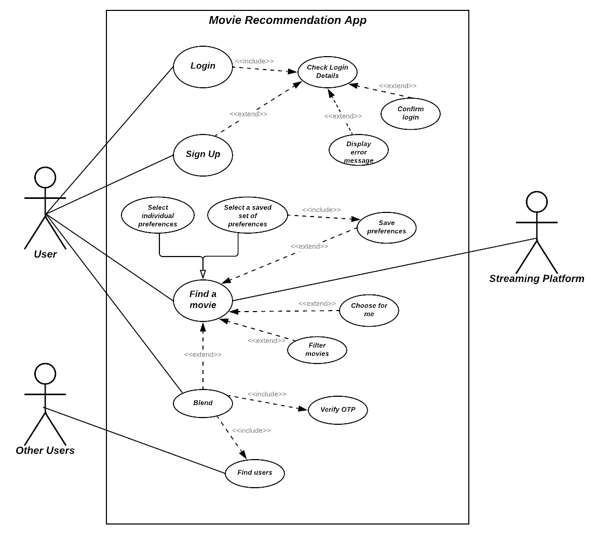
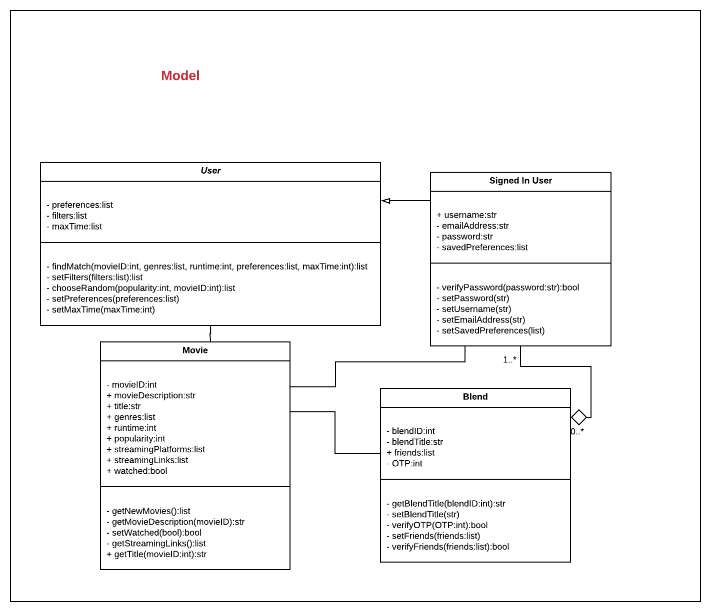
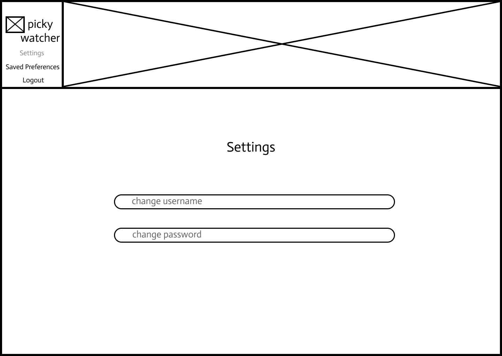

# Coursework 2

Most students will use the same repository for coursework 2. You may use this file to present the results of that
coursework if you wish. Alternatively you can use video or audio to provide the explanations instead of writing them.

## **Requirements definition and analysis**

Requirements engineering is an iterative process in software engineering in which the expected capabilities of a finished product are discovered (or elicited), made more specific, validated and possibly changed. It plays an integral role in the development of a product, as these requirements come to shape the product goals which engineers, product managers and designers refer back to throughout development to ensure the product, once built, meets stakeholders' expectations. 

The innate complexity of software engineering projects is facilitated by the dividing up the work across different roles carried out by various team members. However, this "split" introduces complexities of its own such as fractionated progress due to individual interpretations of product goals. Requirements help manage this, as they ensure team members share a united perspective on the expectations of the finished product. This reduces project cost, as it mitigates the risk of building unsuccessful products.

 

### **Requirements identification methods**

The BABOK Guide (Business Analysis Body of Knowledge) provides a number of techniques that can be used to elicit requirements for software engineering projects. As a project is fundamentally underpinned by a need to serve users, they serve as the most useful source for discovering (or gathering) requirements.

Although the requirements identification methods available for this project are limited to solely brainstorming, if this were a real-world project, I believe focus groups, user interviews and observation would also be useful methods to undertake. (why??)

To ensure I gathered a diverse range of requirements through brainstorming, I followed divergent design thinking principles to arrive at a number of ideas. Here's a few examples of some of the basic requirement ideas I came up with:

- Login/Create Account functionality
- Users with accounts can indicate what movies they've watched already
- Filter by streaming platform option

### **Requirement specification method**

After identifying a number of requirements, I formalised each of these into user stories. I chose this specification method as it uses natural language, thus ensuring widespread comprehensibility, and it goes even further by providing an insight into the rationale behind each user requirement, which the traditional "shall" natural language specification does not. User stories are also commonly used by Agile teams to specify requirements, so this method seemed appropriate given that this project is underpinned by the Data-driven Scrum methodology (which is an Agile framework). 

In specifying my requirements into user stories, I was also able to identify three individual user types for this web-app. Each of these user-types has a unique end-goal for their use of this web-app, described by their type title:

1. **Binge-watcher** (these users have a need for speed and are driven by a desire to find and watch movies that moderately match their preferences as soon as possible)
2. **Host** (these users want to find and watch movies that suit a group of people's combined preferences)
3. **Aficionado** (these users are more particular about the movies they watch and are willing to spend more time deciding, as long as what they eventually choose to watch closely matches their preferences)

 Individuating users by type as opposed to conflating them all together helped inform my understanding of my users' potential desires and interactions; as such, I was able to come up with a few more requirements.

### **Prioritisation method**

To prioritise my requirements, I considered a number of methods commonly adopted across software engineering and its related disciplines; namely the MoSCoW method, the Relative Weighting method and the 100-point method ([find here a more exhaustive list of prioritisation methods](https://toolkits.dss.cloud/design/)). I selected these three methods due to their simple quantification and/or categorisation of requirements according to realistic criteria (such as feasibility, cost, benefit etc.), which allows for more rapid prioritisation by product owners and software engineers. 

Although the MoSCoW method is more commonplace in Agile applications, I preferred to use a method which quantifies requirements, as opposed to simply categorising them, as this facilitates the creation of hierarchy in the requirements backlog. Ultimately, I chose the **Relative Weighting method** as its quantification takes into account the predicted benefit, penalty, cost and risk of each requirement, thus making it a considerably informed prioritisation method. Conversely, the 100-point method wasn’t chosen as, in spite of also quantifying requirements, it effectively represents a voting poll, with each voter scoring requirements using independent, undocumented criteria; as such, I felt requirements' scores were somewhat inconsistent. 

### **Documented and prioritised requirements**

Find here the [full list of prioritised requirements](Requirements.csv)

### Validation

I validated my set of requirements against the following criteria:

| Requirement | Validity (Y/N) | Consistency (Y/N) | Completeness (Y/N) | Realism (Y/N) | Verifiability (Y/N) |
| --- | --- | --- | --- | --- | --- |
|  |  |  |  |  |  |
|  |  |  |  |  |  |
1. Validity - do they reflect the real, changing needs of the users?
2. Consistency - is there duplication or any contradictory constraints?
3. Completeness - do they include everything needed?
4. Realism - can they realistically be implemented in the technology, budget and time?
5. Verifiability - can they be tested?

Given the validation criteria and their relative weighting scores, I decided to implement all the requirements except ... and ...
ltimately I decided to implement the majority of the listed requirements, aside from last one as they seemed more ... (?? did I? - yes i did: i will not be implementing the requirement which connects accounts -- too hard, can't access data)

## Design

### The Application Design

&&&// Notes and thoughts //&&&

#### Embodying The User

The user’s actions and thoughts underpin all aspects of the design of an application, therefore in the effort to build effective, intuitive software, it seemed apt to start by deeply exploring the user’s potential interactions with the system.

#### MVC (Model-View-Controller)

As implied in the initial repository for this project, although this web-app has the potential for useful applications across all manner of movie streaming platforms, for this initial minimum viable product (MVP) version of the app, we will be focusing on streamlining it for use with Netflix specifically. However, as the goal remains for the app to be compatible with a wide variety of streaming platforms, scalability and flexibility of this software is imperative. The use of design patterns in its development will help support this, and they ensure ease of maintainability of code. 

For this project, the Model-View-Controller (MVC) pattern has been employed. 

**Model: Class Diagram**

... (thoughts, discoveries, decisions and adaptations)

*Class Diagram*

**View: Wireframes**

The “view” aspect of the MVC pattern represents the structure and appearance of the user interface (UI). Here, this will be depicted using wireframing, as this method permits both a low-fidelity visualisation of the user interface and an understanding of the flow of web pages (i.e. how users navigate through the app/what happens when they click what) which supports the development of the information structures (such as classes, entities and data) underlying the UI.

... (thoughts, discoveries, decisions and adaptations)

According to a 2017 survey, 42% of people prefer to use their laptop or desktop to watch TV shows, compared to 13% for smartphone fans and 23% television traditionalists. Although the statistics would likely be quite different for movies, due to widespread appreciation for enjoying cinema on the "big screen", the results of the 2017 survey imply that people are substantially more likely to watch movies on their laptop/desktop than their phones. For this reason,  I decided to optimise the app for desktop use, as it seemed that it would be the most likely Internet-connected device of choice for movie-watchers. 

##### Wireframes

  
Wireframes

  
  ### Homepage (Not Signed In) (01)
  

  ### Homepage (Signed In) (01*)
  

  ### Choose For Me (02)
  

  ### Results (03)
  

  ### Movie Listing (04)
  

  ### Blend (05)
  

  ### Blend OTP Confirmation (06)
  

  ### Create Account (07)
  

  ### Sign In (08)
  

  ### Settings (09)
  

  ### Saved Preferences (10)
  

**Controllers (and Routes)**

*Table*
| Route | View Description ([Refer to Wireframes for Views](#wireframes)) | Controller Function |
| --- | --- | --- |
| '/' | Index/Homepage (01) | **index()** |
| '/users/<*username*>' | Profile for a given user | **display_profile(username)** |
| '/users/signup' | Create Account page (07) | **create_account()** |
| '/users/login' | Login page (08) | **login()** |
| '/movie/choose/"<*sessionID*>"' | Choose For Me (02) | **choose_for_me()** |
| '/movie/<*movieID*>' | Movie Listing page (04) | **display_movie_listing(movieID)** |
| '/movie/results/<*sessionID*>' | Results page (03) | **display_results(sessionID)** |
| '/users/blend/<*blendID*>' | Blend page (05) | **blend(blendID)** |
| '/users/settings/<*username*>' | Settings page (09) | **display_settings(username)** |
| '/users/saved/<*username*>' | Saved Preferences (10) | **display_saved(username)** |

### Relational database design

... notes thoughts...

Find below an ERD representing the logical design stage of the relational database design of this application. 

  
More detailed entities including constraints for each attribute

  ### User Entity
  

  ### Movie Choice Entity
  

  ### Movie Entity
  

  ### Blend Entity
  

  

  
Earlier conceptual database design

  ### Initial Conceptual Database Design
  

  

## Testing
### Choice of unit testing library

### Tests
The tests should be in a separate and appropriately named file/directory.

### Test results
Provide evidence that the tests have been run and the results of the tests (e.g. screenshot).

### Continuous integration (optional)
Consider using GitHub Actions (or other) to establish a continuous integration pipeline. If you do so then please provide a link to the .yml and a screenshot of the results of a workflow run.

## Weekly progress reports

### Report 1

**What I did in the last week:**

I assessed the requirements for my app by breaking down users needs through writing user stories and categorising these into app features. I then specified these using the MoSCoW prioritisation technique

**What I plan to do in the next week:**

I'll visualise these requirements by designing wireframes for my app. I'll also go deeper into breaking down how I'll achieve each of these requirements using application architecture (and possibly UML)

**Issues blocking my progress:**

None

### Report 2

**What I did in the last week:**

I explored some commonly-used design patterns for Flask (e.g. MVC and Facade) and designed wireframes for my app.

**What I plan to do in the next week:**

Next week I plan to further flesh out my work on the design for this web-app and explore aspects of database design.

**Issues blocking my progress:**

I've had to leave the country at short notice for familial reasons - as such, preparations for the trip and the long flight have meant that I've had less time than I'd have liked to make progress in the project. This won't be a problem in future sprints, as I plan to be back at the start of the week.

### Report 3

**What I did in the last week:**

Learnt about code quality standards and applied this learning to my work

**What I plan to do in the next week:**

I plan to run some unit tests on my code

**Issues blocking my progress:**

Time spent abroad did impede my work slightly at the start of the week, but things are picking up

### Report 4

**What I did in the last week:**

Unfortunately, I haven't been able to make any progress on the coursework project this week

**What I plan to do in the next week:**

Next week, I plan to practice running unit tests using the pytest tool and wrap up the coursework 

**Issues blocking my progress:**

I have been unwell for the past week, which has made it quite difficult to work. I can't predict when this will cease to be a problem, but hopefully, it will be soon.

## References

Delete this instruction text before submitting:

- Include references to any templates you have used.
- If you justify any of your choices with references then remember to also include these.
- Use any [referencing style](https://library-guides.ucl.ac.uk/referencing-plagiarism/referencing-styles) that you are
  used to using in your course.

https://www.simplilearn.com/agile-prioritization-techniques-article
https://www.mountaingoatsoftware.com/blog/non-functional-requirements-as-user-stories
https://www.youtube.com/watch?v=zid-MVo7M-E